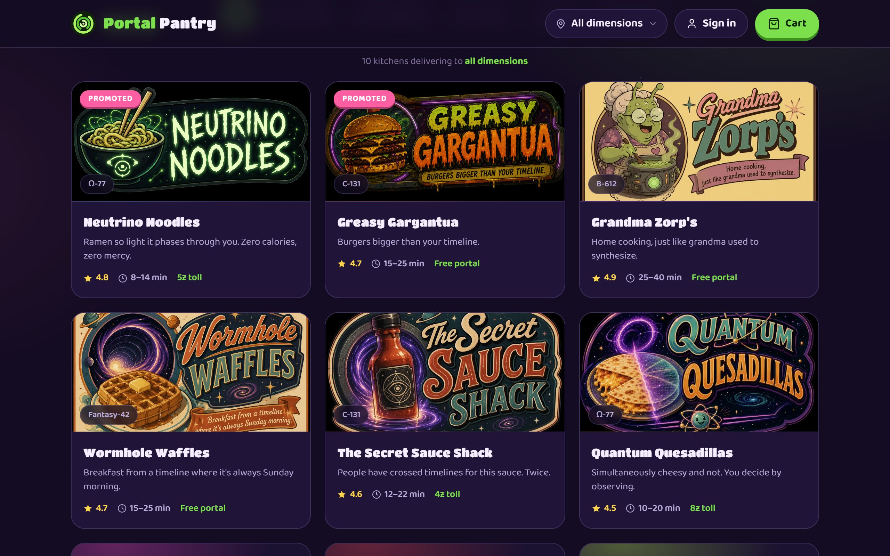
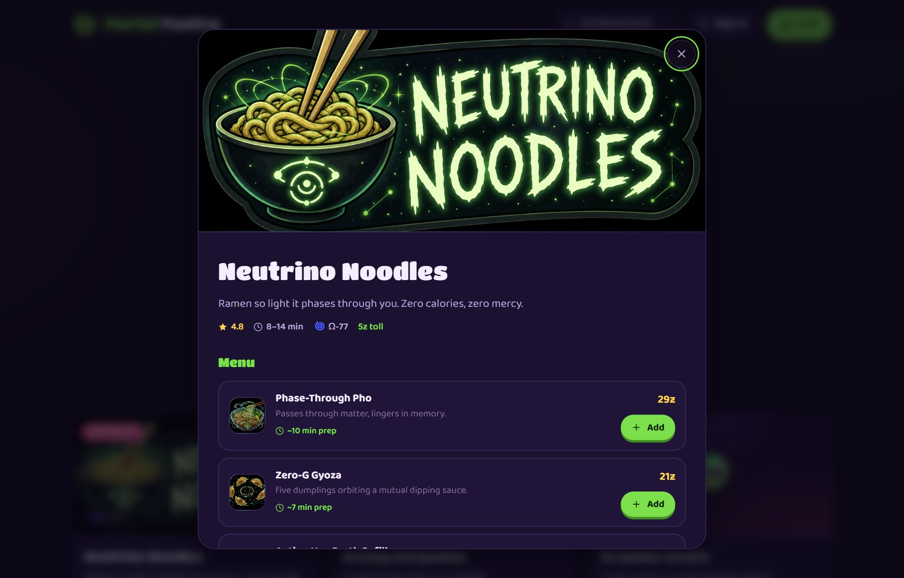
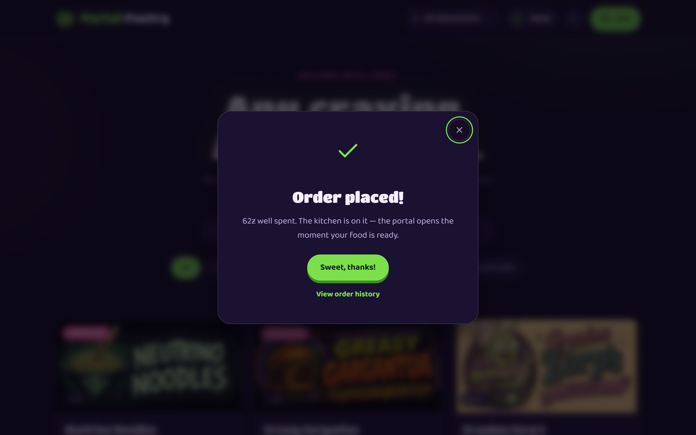
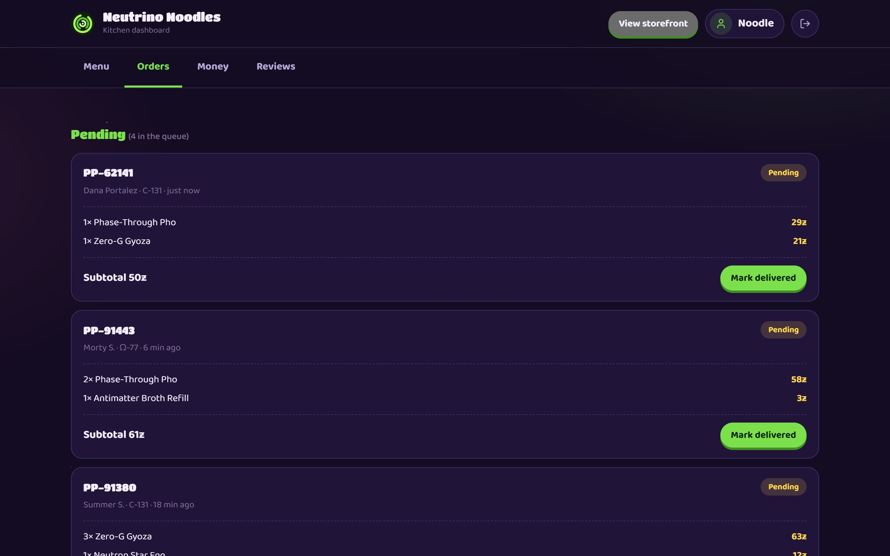
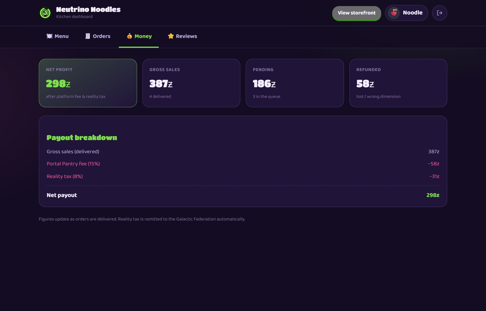

<div align="center">

# Portal Pantry

**Interdimensional food delivery — Uber Eats for the multiverse.**

[](https://react.dev)
[](https://www.typescriptlang.org)
[](https://vite.dev)


[](https://www.zntsns.com/portal-pantry/)

**[▶ Try the live demo](https://www.zntsns.com/portal-pantry/)** · built by
[David Guijosa](https://www.zntsns.com)

</div>



Portal Pantry is a full food-delivery app with a **production-shaped
architecture** — two account roles (customer & store owner), session auth, an
owner analytics dashboard, reviews, and in-browser image uploads. It runs **two
ways from the same UI**: against a zero-setup **in-browser mock backend** (state
persists to `localStorage`), or against the included **real Node.js + SQLite
backend** — identical API contract, switched with a single environment variable.

> Everything here is fictional. Any resemblance to your dimension is a
> scheduling coincidence.

---

## What it does

### For customers
- **Browse & filter** kitchens by *dimension* and food category, with search.
- **Restaurant menus** with dish photos, descriptions, per-item **prep times**,
  and a photo **lightbox** ("open it bigger").
- **Cart & checkout** with a wormhole toll, "reality tax", and an animated
  portal sequence — your order lands in the kitchen's live queue as *pending*.
- **Order history** scoped to your account, with live statuses.
- **Write reviews** (star rating + text) that update the kitchen's rating.
- **Register** a new account or sign in.

### For store owners
- A dedicated **dashboard** (its own hash route, `#/manage`) with four tabs:
  - **Menu** — rename/reprice dishes, edit descriptions & prep times, add new
    dishes, upload/replace photos, delist/relist, edit the storefront.
  - **Orders** — the live pending queue + past orders; mark orders delivered.
  - **Money** — gross sales, pending, refunds, platform fee (15%), reality tax
    (8%), and **net payout** — all computed server-side.
  - **Reviews** — read every review and reply to them.
- **Create your own restaurant** at registration.
- Owners can't order (enforced by the server, not just the UI).

<table>
  <tr>
    <td width="50%"><p align="center"><em>Restaurant menu — photos, prep times & reviews</em></p></td>
    <td width="50%"><p align="center"><em>Checkout — order placed through the portal</em></p></td>
  </tr>
  <tr>
    <td width="50%"><p align="center"><em>Owner dashboard — live order queue</em></p></td>
    <td width="50%"><p align="center"><em>Owner dashboard — payout breakdown</em></p></td>
  </tr>
</table>

---

## Architecture

The app is wired like a real client/server app across three layers. The typed
SDK the UI imports never changes — only the transport beneath it does, so the
same components run against either backend.

```
components/ ──► api/*.ts ──► apiClient ──┬─► server/             in-browser mock (localStorage)
  React UI      typed SDK    transport   └─► portal-pantry-back/ real Node API (Express 5 + node:sqlite)
```

- **`api/*.ts`** — typed SDK modules (`authApi`, `storeApi`, `ordersApi`) the
  components import. The UI never touches a "database" directly.
- **`api/apiClient.ts`** — a `fetch`-shaped transport with an automatic bearer
  token. When `VITE_API_URL` is set it makes **real HTTP calls** to the Node
  backend; when it isn't, it routes to the in-browser mock (simulated latency).
- **`server/` — in-browser mock.** A normalized **database** (`users`,
  `sessions`, `restaurants`, `menu_items`, `orders`, `reviews`) seeded on first
  run and persisted to `localStorage`, behind a **router** with real HTTP
  semantics: bearer-token sessions, ownership checks, status-coded validation
  (`401` / `403` / `404` / `409` / `422`).
- **`portal-pantry-back/` — real backend.** The same contract as a standalone
  **Express 5 + TypeScript** service on Node's built-in `node:sqlite`: same
  tables, same status codes, seeded on first boot. Delisted dishes are filtered
  and finances computed server-side in both.

### A few endpoints

Both backends implement the same contract:

| Method & path | Auth | Purpose |
|---|---|---|
| `POST /auth/register` · `POST /auth/login` | — | create / start a session |
| `GET /restaurants` | — | public catalog (delisted items hidden) |
| `POST /restaurants/:id/reviews` | customer | leave a review |
| `GET /owner/orders` · `PATCH /owner/orders/:id` | owner | queue & mark delivered |
| `GET /owner/finance` | owner | gross, fees, tax, net |
| `POST /owner/menu-items` · `PATCH /owner/menu-items/:id` | owner | add / edit dishes |

Owner-uploaded images are resized & re-encoded to WebP **in the browser**
(canvas) and stored as data URLs, so uploads stay small and survive reloads.

---

## Tech

- **Frontend** — React 19 + TypeScript (strict), no state library (plain hooks),
  hand-written CSS (cosmic dark theme, `Titan One` + `Baloo 2`), built with Vite.
  Zero third-party runtime dependencies.
- **Backend (optional)** — Node 22+ · Express 5 · `node:sqlite` · Zod validation
  · pino logging · Vitest. Typed end-to-end; seeds its database on first boot.

## Run it

**Option A — zero setup (in-browser mock).** No backend, no config; state lives
in `localStorage`.

```bash
cd portal-pantry
npm install
npm run dev
# then open http://localhost:5173/portal-pantry/
```

**Option B — with the real backend.** Run the API (needs **Node ≥ 22.5** for
`node:sqlite`), then point the frontend at it.

```bash
# 1) start the API — seeds a SQLite DB on first boot, listens on :4000
cd portal-pantry-back
npm install
npm run dev

# 2) in another shell, point the frontend at it and run it
cd portal-pantry
npm install
# uncomment VITE_API_URL in .env.local (or create the file):
#   VITE_API_URL=http://localhost:4000
npm run dev
```

Delete `.env.local` (or unset `VITE_API_URL`) to fall back to the mock. Backend
config — port, DB path, CORS origins, session TTL — is documented in
`portal-pantry-back/.env.example`.

The backend ships a **Vitest** suite (auth, catalog, orders, and the owner API);
run it with `npm test` from `portal-pantry-back`.

**Try the owner side:** sign in as `owner@neutrino.pp` (any 4+ char password),
or register a new owner account to create your own kitchen from scratch.

**Reset the demo:** on the mock, clear the site's `localStorage` (DevTools →
Application → Local storage) and reload; on the real backend, delete its SQLite
file under `portal-pantry-back/data/` and restart. Either way the universe
reseeds itself.

---

## Deployment

The frontend is a static build (`npm run build`) served under the
`/portal-pantry/` base path — it ships as one project inside my portfolio
**monorepo**, which builds and deploys it to **Firebase Hosting**. The live
site is **<https://www.zntsns.com/portal-pantry/>**. (That CI/CD lives in the
monorepo, not this repo.)

The hosted build ships the in-browser mock, so the public demo runs entirely
client-side with no server to operate. To serve it against a live API instead,
set `VITE_API_URL` at build time and add the site's origin to the backend's
`CORS_ORIGINS`.
